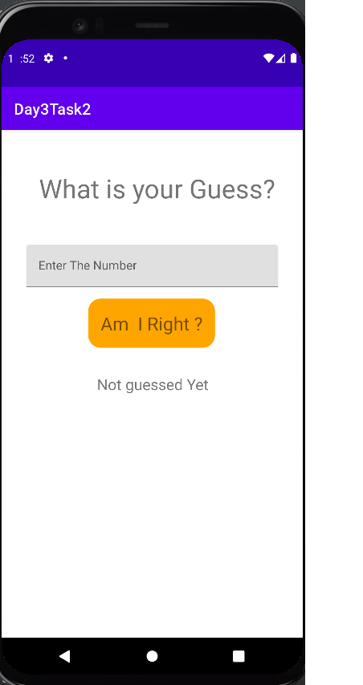
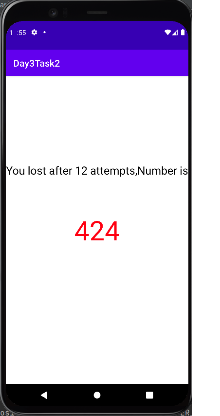
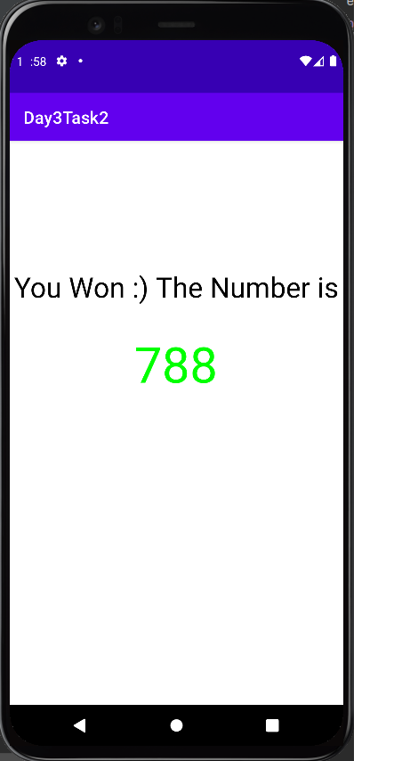

# Android-Studio---Task-3.2

Change the previous application that played a game with you.

1. Now, after you win, the application should start a new activity, EndGameActivity, telling that you won the game, writing the correct number with large green digits.

2. If you haven't won during 12 attempts, after the 12th attempt, the application should start a new activity, telling you've lost the game, writing the correct number with large red digits

3. If you are in progress of guessing (you've made less than 12 attempts and still haven't won), the application should work without changes (just telling you normally you haven't yet found the solution).

<h3>Start Page</h3>
 
<h3>After the 12th attempt, the application telling you've lost the game</h3>
 
<h3>After you win, the application  telling that you won the game.
</h3>
 
